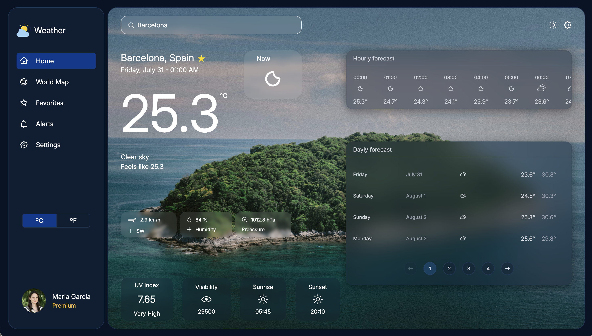
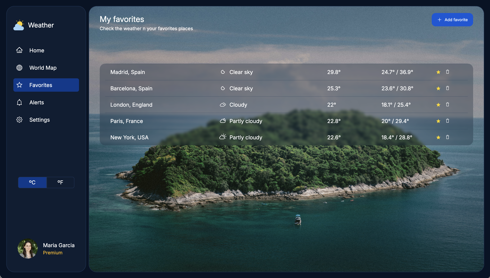

# 🌤️ Weather Forecast Dashboard

A modern weather application built with React, TypeScript and Vite that allows users to search for cities worldwide, check current weather conditions, explore forecasts and manage favorite locations.

The project was developed following a feature-oriented architecture, separating the application by business domains to improve scalability and maintainability.

---

## Features

### City Search

* Search cities worldwide.
* Coordinate lookup through geocoding services.
* Debounced search requests.
* Loading and error handling states.

### Current Weather

* Current temperature.
* Weather condition description.
* Humidity.
* Wind speed.
* Atmospheric pressure.
* Visibility.
* UV Index.
* Sunrise and sunset information.

### Forecast

* Hourly forecast.
* Daily forecast.
* Forecast pagination.
* Dynamic weather icons.

### Favorite Cities

* Add cities to favorites.
* Remove cities from favorites.
* Visual favorite indicator.
* Dedicated favorites section.

### Temperature Units

* Celsius support.
* Fahrenheit conversion.
* Global temperature preference through Context API.

---

## Tech Stack

### Frontend

* React 19
* TypeScript
* Vite

### Data Management

* TanStack React Query
* Axios

### Routing

* React Router

### Styling

* Tailwind CSS v4

### UI & Icons

* Radix UI Icons
* React Icons
* Weather Icons React

---

## 🏗 Architecture

The project follows a **Feature-Based Architecture**, organizing the code around business domains instead of technical layers.

This approach improves scalability, maintainability and code discoverability by keeping each feature responsible for its own components, hooks, services and state management.

### Project Structure

```text
src
├── app
│   ├── Providers.tsx
│   ├── RootLayout.tsx
│   └── router.tsx
│
├── common
│   ├── components
│   ├── hooks
│   ├── interfaces
│   └── types
│
├── infrastructure
│   ├── interfaces
│   └── mapper
│
├── modules
│   ├── search_by_city
│   ├── weather_forecast
│   └── favorites_cities
│
├── pages
├── utility
└── assets
```

---

### search_by_city

Handles the city search experience and user weather preferences.

Responsibilities:

* Search input management.
* City coordinate retrieval.
* Search debouncing.
* Temperature unit management.
* Weather parameter presentation.

Structure:

```text
search_by_city
├── components
│   ├── SearchBar
│   ├── AtmosParams
│   └── ViewParams
│
├── hooks
│   ├── useCoordCity
│   └── useDebounce
│
└── context
    ├── TempUnityContext
    └── TempUnityProvider
```

---

### weather_forecast

Responsible for weather data retrieval and forecast visualization.

Responsibilities:

* Weather API integration.
* Current weather retrieval.
* Hourly forecast generation.
* Daily forecast generation.
* Forecast pagination.
* Weather data orchestration.

Structure:

```text
weather_forecast
├── components
│   ├── Forecast
│   ├── CustomPagination
│   └── ButtonPag
│
├── hooks
│   ├── useWeather
│   └── useForeCast
│
└── service
    ├── getWeather.service
    ├── searchCity.service
    ├── api.config
    └── constants
```

---

### favorites_cities

Responsible for favorite city management.

Responsibilities:

* Favorite city storage.
* Add and remove favorite cities.
* Favorite state synchronization.
* Favorite weather retrieval.
* Favorite city presentation.

Structure:

```text
favorites_cities
├── components
│   └── FavoritesCities
│
├── hooks
│   ├── useFavoriteCity
│   └── useWeatherData
│
├── context
│   ├── FavoriteCittyContext
│   └── FavoriteCittyProvider
│
├── data
│   └── favorites_cities.mock
│
└── interfaces
```

---

### Shared Layers

#### app

Contains application-level configuration:

* Router configuration.
* Global providers.
* Root layout.

#### common

Contains reusable application-wide resources:

* Shared components.
* Shared hooks.
* Shared interfaces.
* Shared types.

#### infrastructure

Contains domain-independent mapping and transformation logic:

* Weather code mapping.
* UV index mapping.
* API response transformation.
* Shared interfaces.

#### utility

Contains pure helper functions:

* Date formatting.
* Temperature conversion.
* Generic utility functions.

---

### State Management Strategy

The application uses two complementary approaches:

#### React Query

Used for server state:

* Weather requests.
* Forecast requests.
* Request caching.
* Loading and error handling.

#### Context API

Used for global client state:

* Temperature unit preferences.
* Favorite cities management.

This separation keeps server state and UI state clearly isolated.


## Data Flow

### Search Flow

1. User searches a city.
2. Geocoding service retrieves coordinates.
3. Coordinates are used to request weather data.
4. Current conditions and forecasts are displayed.

### Favorites Flow

1. User clicks the star icon.
2. City is added or removed from favorites.
3. Favorite context updates globally.
4. UI automatically reflects the current favorite state.

---

## Important Custom Hooks

### useForecast

Coordinates weather data retrieval and forecast generation.

### useWeather

Handles weather queries and server state.

### useCoordCity

Retrieves city coordinates from search input.

### useFavoriteCity

Encapsulates favorite city logic and star toggle behavior.

### useDebounce

Reduces unnecessary requests while searching.

---

## Getting Started

### Clone repository

```bash
git clone <repository-url>
cd frontend-challenge
```

### Install dependencies

```bash
npm install
```

### Start development server

```bash
npm run dev
```

### Build production version

```bash
npm run build
```

### Preview build

```bash
npm run preview
```

---

## Available Scripts

| Command         | Description              |
| --------------- | ------------------------ |
| npm run dev     | Start development server |
| npm run build   | Build production version |
| npm run preview | Preview production build |
| npm run lint    | Run ESLint               |

---

## Technical Decisions

### Feature-Based Architecture

The project is organized around business domains rather than technical categories.

Advantages:

* Better scalability.
* Easier maintenance.
* Clear separation of concerns.
* Improved code discoverability.

### React Query

Chosen to manage asynchronous server state efficiently while reducing boilerplate code.

### TypeScript

Provides stronger type safety, improved tooling and easier refactoring.

### Tailwind CSS

Allows rapid UI development while keeping styles consistent and maintainable.

---

## 🔮 Future Improvements

* Persist favorite cities using Local Storage or backend storage.
* Weather alerts integration.
* Interactive map visualization.
* Dark mode support.
* Unit and integration testing.
* Progressive Web App (PWA).
* Internationalization (i18n).

---

## 👨‍💻 Author

**Carlo Fidel Taboada**

Frontend Technical Challenge built with React, TypeScript, React Query, Vite and Tailwind CSS.

# Preview

## Home



## Favorites

